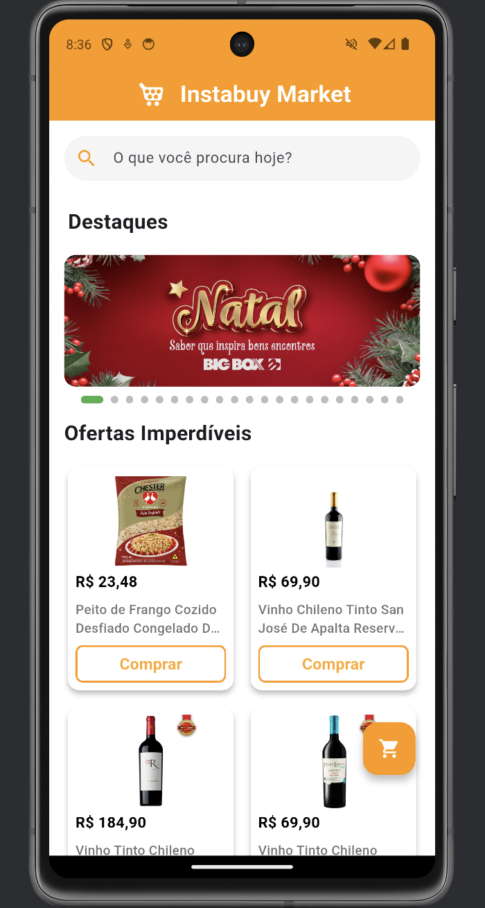
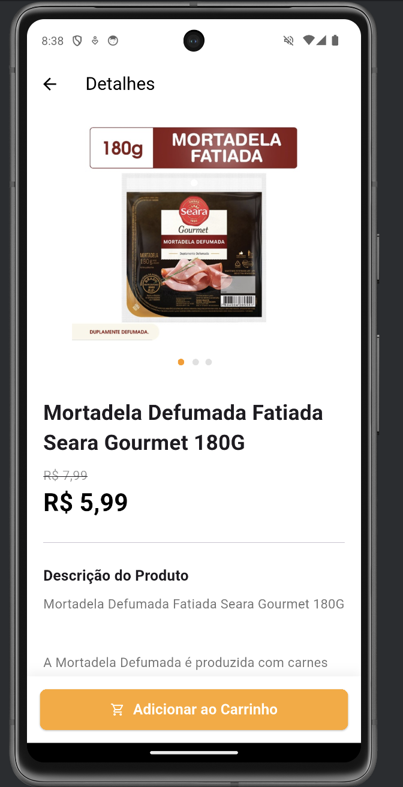
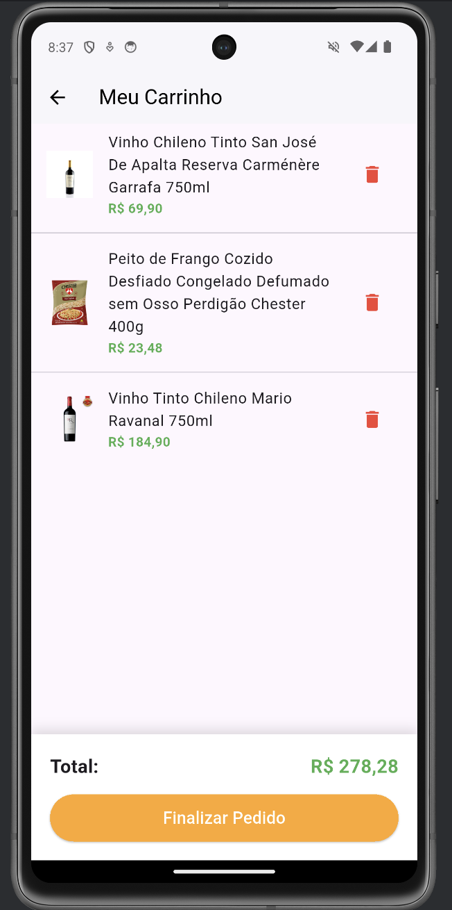

# 🛒 Instabuy - Desafio Técnico Flutter

> Aplicativo de E-commerce desenvolvido como parte do desafio técnico para a vaga de Desenvolvedor Mobile Flutter.

O objetivo deste projeto foi desenvolver uma aplicação funcional consumindo uma API REST, com foco em arquitetura limpa, experiência do usuário (UX) e performance.

---

## 📱 Telas e Funcionalidades

| Home & Busca | Detalhes (Hero) | Carrinho |
|:---:|:---:|:---:|
|  |  |  |
| *Carrossel, Grid e Busca* | *Animação Hero e Galeria* | *Gestão de estado global* |

*(Nota: Caso as imagens não carreguem, elas estão disponíveis na pasta /screenshots)*

###   Principais Features

* **Vitrine Dinâmica:** Listagem de produtos em Grid consumindo API REST.
* **Carrossel de Destaques:** Banner rotativo estilo "iFood" utilizando `PageView` com indicadores.
* **Busca em Tempo Real:** Filtragem local de produtos instantânea.
* **Detalhes do Produto:**
    * Galeria de imagens deslizante.
    * Animação **Hero** (transição fluida da lista para o detalhe).
    * Tratamento de texto HTML (remoção de tags da API).
* **Carrinho de Compras:**
    * Adição e remoção de itens.
    * Cálculo automático de total.
    * Feedback visual via **SnackBar** customizada (com miniatura do produto).

---

## 🛠️ Tecnologias e Arquitetura

O projeto foi construído utilizando **Flutter** e **Dart**, priorizando soluções nativas e performáticas.

* **Gerência de Estado:** Pattern **Singleton** (`CartService`) para persistência do carrinho em memória durante a sessão. Escolhido pela simplicidade e eficácia para o escopo do desafio.
* **Requisições HTTP:** Pacote `http` para comunicação com a API REST.
* **Layout:** Uso de `CustomScrollView` e `Slivers` para garantir performance na rolagem de listas complexas.
* **Clean Code:** Separação de responsabilidades em:
    * `models`: Representação dos dados.
    * `services`: Lógica de negócios e chamadas externas.
    * `screens`: Interfaces de usuário.
    * `widgets`: Componentes reutilizáveis (ex: ProductCard).

---

## 🧠 Decisões Técnicas

Durante o desenvolvimento, algumas decisões chave foram tomadas:

1.  **Animações Hero:** Implementadas para dar uma sensação de continuidade e polimento visual, elevando a percepção de qualidade do app.
2.  **Singleton no Carrinho:** Ao invés de usar pacotes pesados de injeção de dependência para um escopo pequeno, optei por um Singleton manual, garantindo que o estado do carrinho seja acessível globalmente sem boilerplate desnecessário.
3.  **Tratamento de Strings:** A API retorna descrições com tags HTML (`<br>`, `<p>`). Criei um utilitário com Regex para limpar esses dados e exibir texto puro ao usuário, evitando dependências externas pesadas de renderização HTML.

---

##  Como rodar o projeto

Pré-requisitos: Flutter SDK instalado.

1.  **Clone o repositório:**
    ```bash
    git clone [SEU LINK DO GITHUB AQUI]
    ```

2.  **Instale as dependências:**
    ```bash
    flutter pub get
    ```

3.  **Execute o App:**
    ```bash
    flutter run
    ```

---

## 👨‍💻 Autor

Desenvolvido com dedicação por **LUAN**.
Estou à disposição para apresentar a solução e discutir as decisões de código.